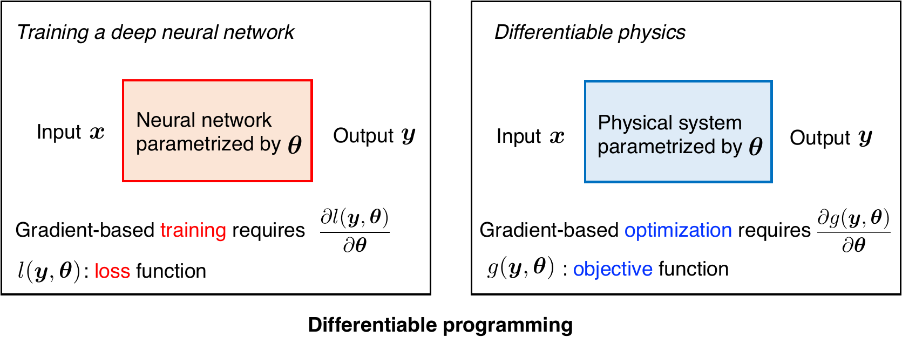
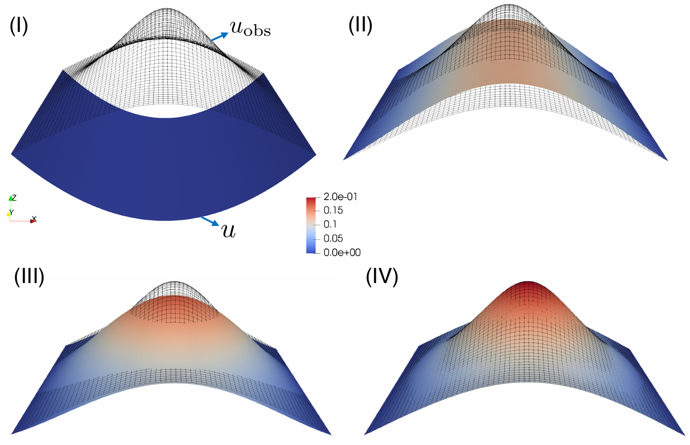
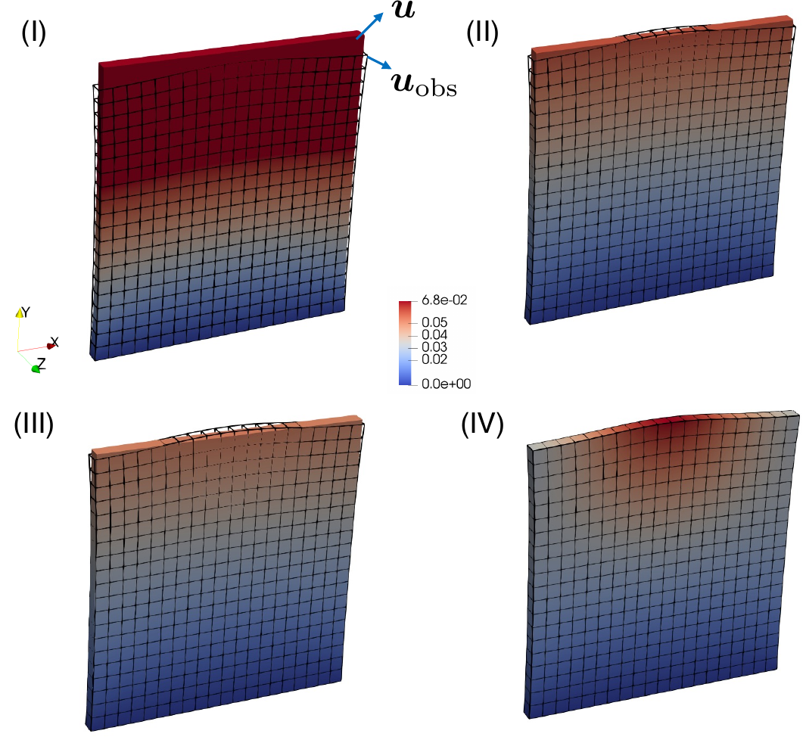
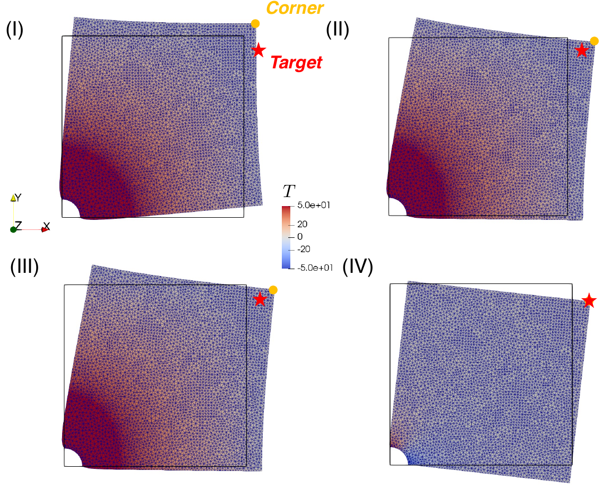
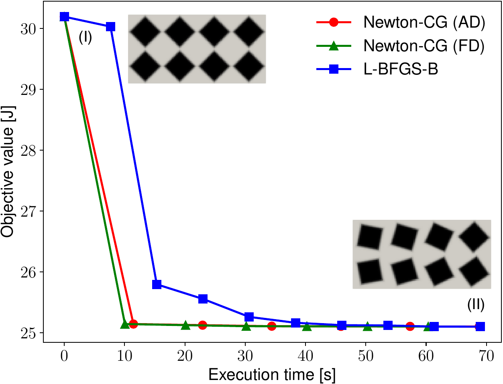

# Hessian for Implicit Differentiation 

This repository has two purposes:

- Provides an implementation for Hessian-vector products in implicit differentiable programming
- Shows more examples of differentiable finite elements based on [JAX-FEM](https://github.com/deepmodeling/jax-fem)

## General picture

  

    <em >Differentiable programming breaks the boundary between deep learning and differentiable physics.</em>

This repository is based on [JAX-FEM](https://github.com/deepmodeling/jax-fem) to solve differentiable physics problems, providing second-order derivative information in the form of Hessian-vector products.

## Quick start

Refer to `simple.ipynb` for a simple illustrative example.

## Installation

Works with [JAX-FEM](https://github.com/deepmodeling/jax-fem) version 0.0.9.

## Examples

### E1: Source field identification

*Goal: Change the source term to match observed data.*

  

    <em >Predicted solutions gradually match the reference data.</em>

### E2: Boundary force identification

*Goal: Change the boundary traction force to match observed displacement.*

  

    <em >Predicted displacements gradually match the reference displacement.</em>

### E3: Thermal-mechanical control

*Goal: Change the boundary temperature to achieve desired deformation.*

  

    <em >Predicted displacements gradually match the reference displacement.</em>

### E4: Shape optimization

*Goal: Rotate the square-shaped holes for better beam stiffness.*

  

    <em >Predicted displacements gradually match the reference displacement.</em>

## Paper

Refer to the arXiv version.

## Citations

If you found this library useful in academic or industry work, we appreciate your support if you consider 1) starring the project on Github, and 2) citing relevant papers.

